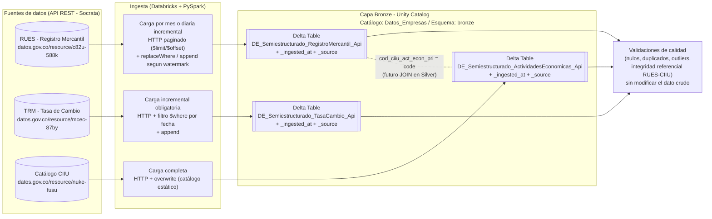

# Trabajo Práctico 1: Arquitectura e Ingesta en Capa Bronze

**Asignatura**: Arquitectura y Gestión de Datos Masivos
**Ponderación**: 15% (Evaluación de la Era 1)
**Entorno**: Databricks (PySpark, SQL, Delta Lake, Unity Catalog)

**Equipo de trabajo**:
- _Nombre integrante 1_
- _Nombre integrante 2_
- _Nombre integrante 3_

## Índice

- [Sección 1: Contexto de Negocio y Resumen de Datos](#sección-1-contexto-de-negocio-y-resumen-de-datos)
- [Sección 2: Diagrama de Arquitectura Inicial](#sección-2-diagrama-de-arquitectura-inicial)
- [Estructura del repositorio](#estructura-del-repositorio)

> El contenido de las Secciones 1 y 2 también vive como notebook de Databricks en [`00_Informe.ipynb`](https://dbc-7478df09-02e1.cloud.databricks.com/editor/notebooks/3744392461485742?o=7474658561793168) — este README es la versión de lectura rápida en GitHub.

---

## Sección 1: Contexto de Negocio y Resumen de Datos

### Justificación del dominio

El caso de estudio analiza la **salud del tejido empresarial colombiano en su contexto macroeconómico**, combinando tres fuentes complementarias:

1. **RUES (Registro Mercantil)**: describe el estado del universo empresarial del país — matrículas, renovaciones, cancelaciones y naturaleza jurídica de personas naturales, jurídicas y ESAL registradas ante las Cámaras de Comercio.
2. **TRM (Tasa Representativa del Mercado)**: es el indicador macroeconómico que más directamente afecta a las empresas con actividad de comercio exterior (importación/exportación, deuda en dólares, insumos importados).
3. **Catálogo CIIU (actividades económicas)**: fuente de referencia que traduce los códigos numéricos de actividad económica de RUES (`cod_ciiu_act_econ_pri`, etc.) a su descripción textual — sin ella, RUES por sí solo no permite saber a qué sector pertenece cada empresa.

Las tres fuentes comparten el mismo dominio de negocio (**actividad económica y empresarial de Colombia**) y se complementan porque permiten, en capas posteriores (Silver/Gold), cruzar la dinámica de creación/cierre de empresas **por sector económico** (uniendo RUES con el catálogo CIIU) con el comportamiento cambiario del mismo periodo (TRM) — por ejemplo, para analizar si la volatilidad del dólar coincide con picos de cancelación de matrículas en sectores exportadores/importadores.

### Ficha técnica — Fuente 1: RUES (Registro Mercantil)

| Campo | Detalle |
|---|---|
| **Nombre del dataset** | Personas Naturales, Personas Jurídicas y Entidades Sin Ánimo de Lucro (RUES) |
| **Origen** | Portal de Datos Abiertos de Colombia (datos.gov.co) — API REST Socrata (SoQL) |
| **Ficha del dataset** | https://www.datos.gov.co/Comercio-Industria-y-Turismo/Personas-Naturales-Personas-Jur-dicas-y-Entidades-/c82u-588k/about_data |
| **API (recurso)** | `https://www.datos.gov.co/resource/c82u-588k.json` |
| **Método de extracción** | HTTP GET paginado (`$limit` / `$offset`), formato JSON |
| **Volumen exacto** | 9.407.309 registros totales (verificado con `$select=count(*)` el 2026-09-14) |
| **Tamaño aproximado** | 36 columnas de texto × ~9.4M filas → varios GB en crudo (JSON) |
| **Recencia** | Actualización continua; el pipeline filtra por `fecha_actualizacion` |
| **Carga usada en el pipeline** | Modo mensual (`replaceWhere`, trunca solo el mes recargado) o modo diario incremental (watermark sobre `fecha_actualizacion`), ver [`02_Ingesta_Bronze_RUES.ipynb`](https://dbc-7478df09-02e1.cloud.databricks.com/editor/notebooks/3744392461485744?o=7474658561793168) |
| **Tabla Bronze** | `Datos_Empresas.bronze.DE_Semiestructurado_RegistroMercantil_Api` |

<strong>Diccionario de datos inicial (RUES)</strong> — todas las columnas llegan como <code>text</code> desde la API

| Columna | Tipo original | Descripción |
|---|---|---|
| codigo_camara | text | Código de la Cámara de Comercio administradora |
| camara_comercio | text | Nombre de la Cámara de Comercio |
| matricula | text | Número de matrícula mercantil |
| inscripcion_proponente | text | Número de inscripción como proponente (contratación pública) |
| razon_social | text | Razón social (personas jurídicas) |
| primer_apellido | text | Primer apellido (personas naturales) |
| segundo_apellido | text | Segundo apellido (personas naturales) |
| primer_nombre | text | Primer nombre (personas naturales) |
| segundo_nombre | text | Segundo nombre (personas naturales) |
| sigla | text | Sigla o nombre abreviado |
| codigo_clase_identificacion | text | Código del tipo de documento de identificación |
| clase_identificacion | text | Tipo de documento (CC, NIT, CE, etc.) |
| numero_identificacion | text | Número de identificación |
| nit | text | Número de Identificación Tributaria |
| digito_verificacion | text | Dígito de verificación del NIT |
| cod_ciiu_act_econ_pri | text | Código CIIU de la actividad económica principal |
| cod_ciiu_act_econ_sec | text | Código CIIU de la actividad económica secundaria |
| ciiu3 | text | Código CIIU adicional (tercera actividad) |
| ciiu4 | text | Código CIIU adicional (cuarta actividad) |
| fecha_matricula | text (`YYYYMMDD`) | Fecha de matrícula inicial |
| fecha_renovacion | text (`YYYYMMDD`) | Fecha de la última renovación |
| ultimo_ano_renovado | text | Último año renovado |
| fecha_vigencia | text (`YYYYMMDD`) | Fecha de vigencia de la matrícula (usa `99991231` como valor centinela "sin vencimiento") |
| fecha_cancelacion | text (`YYYYMMDD`) | Fecha de cancelación de la matrícula (si aplica) |
| codigo_tipo_sociedad | text | Código del tipo societario |
| tipo_sociedad | text | Tipo de sociedad (S.A.S., Ltda, etc.) |
| codigo_organizacion_juridica | text | Código de organización jurídica |
| organizacion_juridica | text | Naturaleza jurídica (Persona Natural, Persona Jurídica, ESAL) |
| codigo_categoria_matricula | text | Código de la categoría de matrícula |
| categoria_matricula | text | Categoría de matrícula |
| codigo_estado_matricula | text | Código del estado de la matrícula |
| estado_matricula | text | Estado actual (Activa, Cancelada, etc.) |
| clase_identificacion_RL | text | Tipo de documento del representante legal |
| num_identificacion_representante_legal | text | Número de identificación del representante legal |
| representante_legal | text | Nombre del representante legal |
| fecha_actualizacion | text (timestamp) | Fecha y hora de la última sincronización del registro en RUES |

### Ficha técnica — Fuente 2: TRM (Tasa de Cambio Representativa del Mercado)

| Campo | Detalle |
|---|---|
| **Nombre del dataset** | Tasa de Cambio Representativa del Mercado - Histórico |
| **Origen** | Portal de Datos Abiertos de Colombia (datos.gov.co) — API REST Socrata (SoQL) |
| **Ficha del dataset (de donde se sacó la info)** | https://www.datos.gov.co/Econom-a-y-Finanzas/Tasa-de-Cambio-Representativa-del-Mercado-Historic/mcec-87by/about_data |
| **API (recurso)** | `https://www.datos.gov.co/resource/mcec-87by.json` |
| **Método de extracción** | HTTP GET con carga **incremental** (`$where` sobre `vigenciadesde`) |
| **Volumen exacto** | ~8.326 registros históricos totales en la fuente (serie diaria desde 1991); la carga inicial del pipeline se limita al **último año** (~250 registros) + 1 registro nuevo cada día hábil |
| **Tamaño aproximado** | 4 columnas, dataset pequeño en filas pero con recencia diaria |
| **Recencia** | Se actualiza diariamente — fuente ideal para demostrar carga incremental |
| **Carga usada en el pipeline** | Carga inicial del último año + **incremental** (`append`) en corridas posteriores, ver [`03_Ingesta_Bronze_TRM.ipynb`](https://dbc-7478df09-02e1.cloud.databricks.com/editor/notebooks/3744392461485745?o=7474658561793168) |
| **Tabla Bronze** | `Datos_Empresas.bronze.DE_Semiestructurado_TasaCambio_Api` |

<strong>Diccionario de datos inicial (TRM)</strong>

| Columna | Tipo original (Socrata) | Descripción |
|---|---|---|
| valor | number | Valor de la TRM (pesos colombianos por dólar) |
| unidad | text | Código de la divisa según ISO 4217 (ej. `COP`) |
| vigenciadesde | calendar_date | Fecha de inicio de vigencia de la tasa |
| vigenciahasta | calendar_date | Fecha de fin de vigencia de la tasa |

### Ficha técnica — Fuente 3: Catálogo CIIU (Actividades Económicas)

| Campo | Detalle |
|---|---|
| **Nombre del dataset** | Catálogo de actividades económicas |
| **Origen** | Portal de Datos Abiertos de Colombia (datos.gov.co) — API REST Socrata (SoQL) |
| **Ficha del dataset** | https://www.datos.gov.co/Econom-a-y-Finanzas/Cat-logo-de-actividades-econ-micas/nuke-fusu/about_data |
| **API (recurso)** | `https://www.datos.gov.co/resource/nuke-fusu.json` |
| **Método de extracción** | HTTP GET, carga completa (catálogo estático) |
| **Volumen exacto** | 499 registros |
| **Tamaño aproximado** | 5 columnas, dataset pequeño (tabla de referencia/lookup) |
| **Recencia** | No aplica — catálogo de códigos, no cambia con el tiempo |
| **Carga usada en el pipeline** | Completa (`overwrite`) en cada ejecución, ver [`04_Ingesta_Bronze_CIIU.ipynb`](https://dbc-7478df09-02e1.cloud.databricks.com/editor/notebooks/3744392461485746?o=7474658561793168) |
| **Tabla Bronze** | `Datos_Empresas.bronze.DE_Semiestructurado_ActividadesEconomicas_Api` |

<strong>Diccionario de datos inicial (Catálogo CIIU)</strong>

| Columna | Tipo original (Socrata) | Descripción |
|---|---|---|
| id | number | Identificador interno del catálogo |
| code | text | Código CIIU (mismo formato de 4 dígitos que `cod_ciiu_act_econ_pri` en RUES) |
| description | text | Descripción de la actividad económica |
| status | number | Estado del código en el catálogo |
| version | number | Versión de la clasificación CIIU |

---

## Sección 2: Diagrama de Arquitectura Inicial

El archivo fuente editable está en [`Trabajo Practico 1 - Arquitectura Inicial (Capa Bronze).drawio.xml`](Trabajo%20Practico%201%20-%20Arquitectura%20Inicial%20%28Capa%20Bronze%29.drawio.xml) — ábrelo en [app.diagrams.net](https://app.diagrams.net) (draw.io) si necesitas editarlo. También queda como referencia la versión en Mermaid (se renderiza automáticamente en GitHub):

**Notas de arquitectura**:
- Las tres fuentes se consultan directamente vía HTTP desde Databricks (no requieren S3 ni Auto Loader, dado que el origen ya es una API REST).
- Las tablas Bronze son Delta Lake puro, dentro del catálogo `Datos_Empresas`, esquema `bronze`.
- RUES se carga por mes o en modo diario incremental; TRM es incremental (`append`) día a día; el catálogo CIIU es una tabla de referencia estática que se recarga completa (`overwrite`) — de ahí la diferencia en el modo de escritura de cada una.

---

## Estructura del repositorio

| Archivo | Sección | Contenido |
|---|---|---|
| [`00_Informe.ipynb`](https://dbc-7478df09-02e1.cloud.databricks.com/editor/notebooks/3744392461485742?o=7474658561793168) | 1 y 2 | Versión notebook de este README: contexto de negocio, ficha técnica, diccionario de datos y diagrama |
| [`01_Configuracion_Inicial.ipynb`](https://dbc-7478df09-02e1.cloud.databricks.com/editor/notebooks/3744392461485743?o=7474658561793168) | — | Creación del catálogo `Datos_Empresas` y el esquema `bronze` en Unity Catalog |
| [`02_Ingesta_Bronze_RUES.ipynb`](https://dbc-7478df09-02e1.cloud.databricks.com/editor/notebooks/3744392461485744?o=7474658561793168) | 3 (Fuente 1) | Pipeline PySpark de RUES: modo mensual (`replaceWhere`) o modo diario incremental |
| [`03_Ingesta_Bronze_TRM.ipynb`](https://dbc-7478df09-02e1.cloud.databricks.com/editor/notebooks/3744392461485745?o=7474658561793168) | 3 (Fuente 2) | Pipeline PySpark de TRM con carga **incremental obligatoria** (`append`) |
| [`04_Ingesta_Bronze_CIIU.ipynb`](https://dbc-7478df09-02e1.cloud.databricks.com/editor/notebooks/3744392461485746?o=7474658561793168) | 3 (Fuente 3) | Pipeline PySpark del catálogo CIIU código→descripción |
| [`05_Validaciones_Bronze.ipynb`](https://dbc-7478df09-02e1.cloud.databricks.com/editor/notebooks/3744392461485747?o=7474658561793168) | 4 | Nulos, duplicados, outliers e integridad referencial RUES↔CIIU sobre las tres tablas Bronze |
| [`Trabajo Practico 1 - Arquitectura Inicial (Capa Bronze).drawio.xml`](Trabajo%20Practico%201%20-%20Arquitectura%20Inicial%20%28Capa%20Bronze%29.drawio.xml) | 2 | Diagrama editable (draw.io / app.diagrams.net) |
| [`Trabajo Practico 1 - Arquitectura Inicial (Capa Bronze).png`](Trabajo%20Practico%201%20-%20Arquitectura%20Inicial%20%28Capa%20Bronze%29.png) | 2 | Imagen exportada del diagrama, embebida en la Sección 2 |

Orden de ejecución recomendado: `00` → `01` → `02` → `03` → `04` → `05`.
